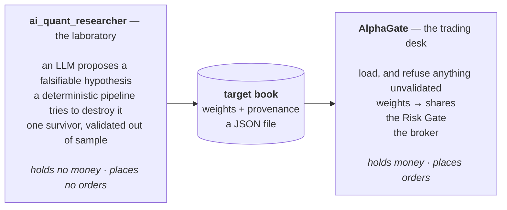
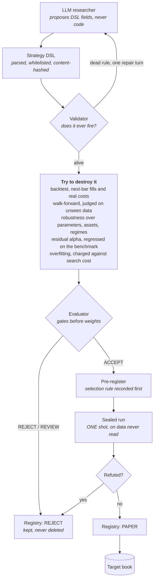
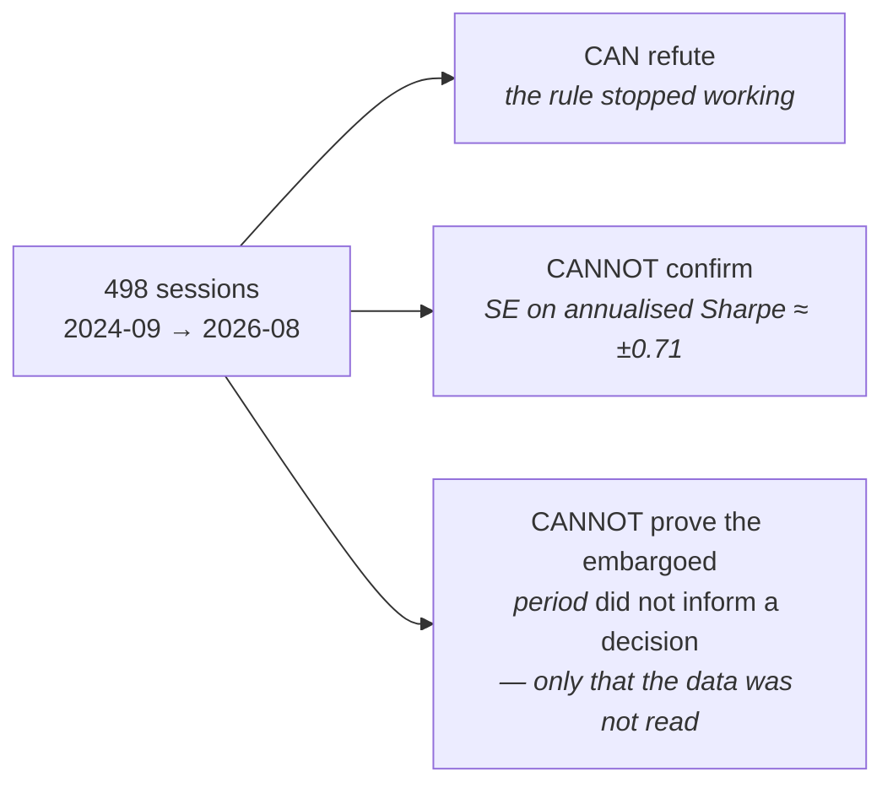
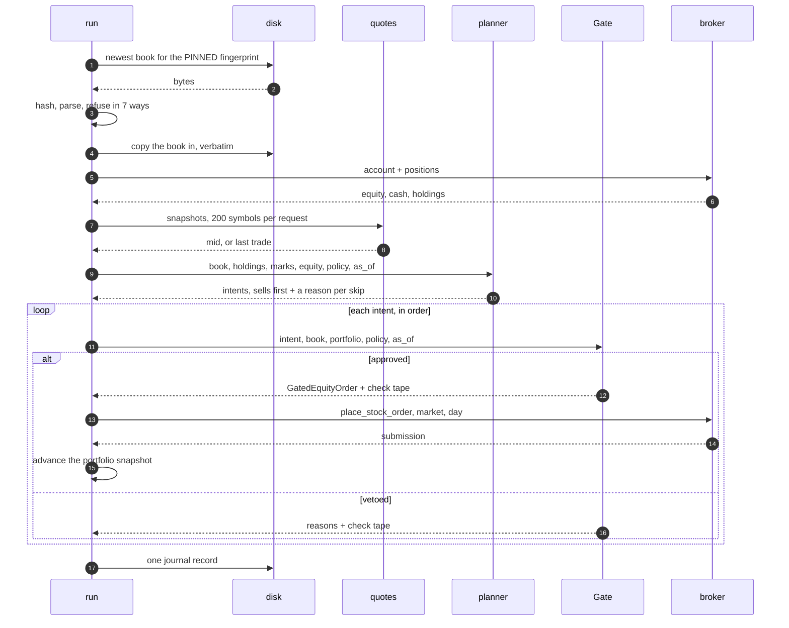
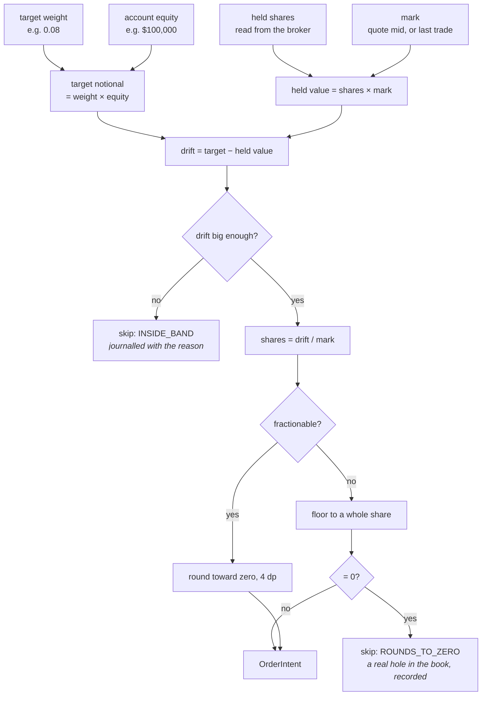
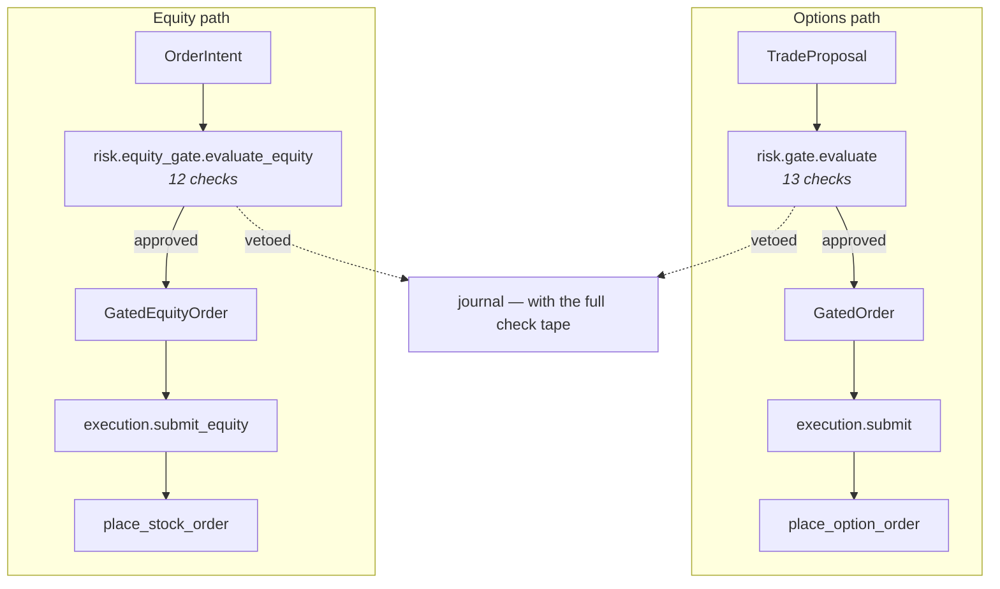
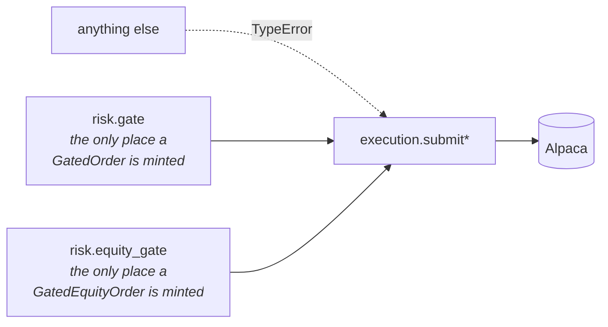
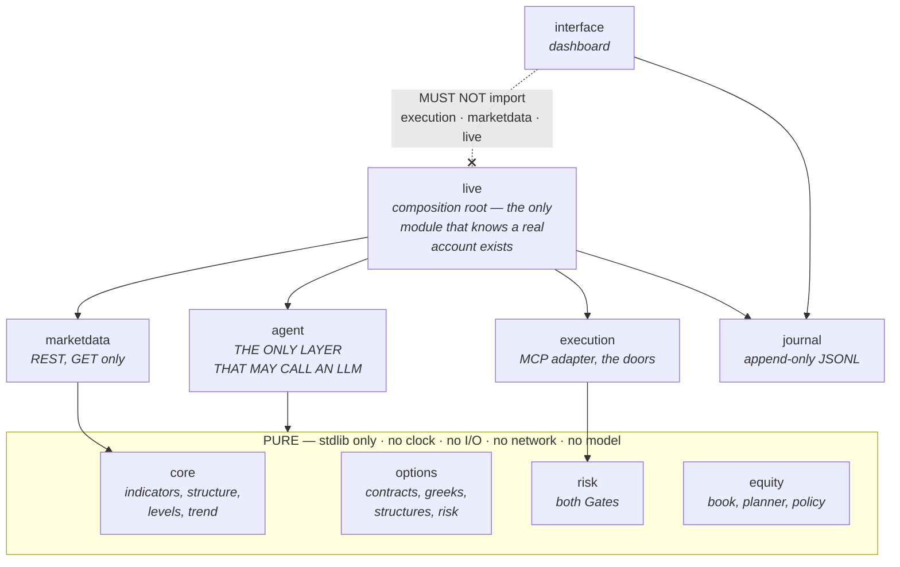
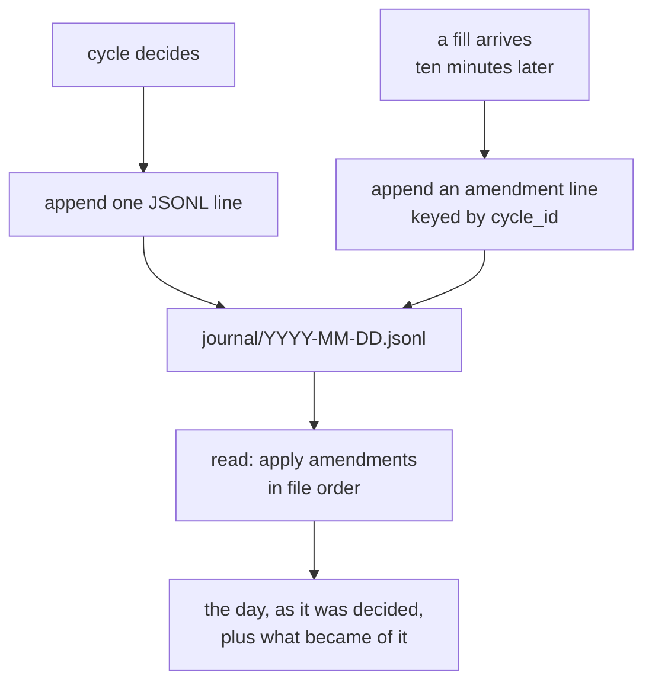
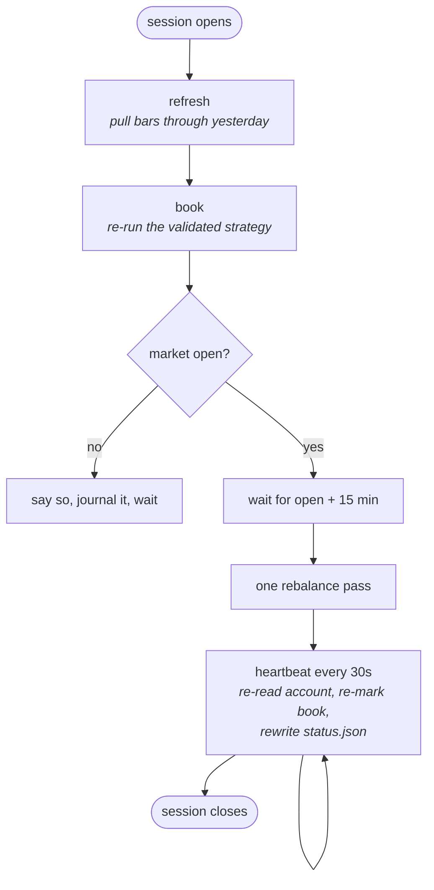

<!-- Language: **English** · [简体中文](ARCHITECTURE.zh-CN.md) -->

*Language:* **English** · [简体中文](ARCHITECTURE.zh-CN.md)

# Architecture and workflow

This document explains **how the system is put together and what happens when it
runs**. For "what is this and how do I start it", read the
[README](../README.md). For the contracts each piece must satisfy, read
[`specs/`](../specs/).

---

## 1. The shape of the whole thing

Two independent systems share this repository. They answer different questions,
hold different invariants, and are connected by exactly one thing: a file.

The laboratory holds no money and places no orders. The desk holds both.

**Why they are separate.** The laboratory has no `Decimal` rule because it holds
no money, and no Risk Gate because it places no orders. The desk has both. An
import in either direction would make one system's invariants the other's
problem. `backend/tests/test_boundaries.py` fails the build if `alphagate`
imports `aqr`, if `aqr` imports `alphagate`, or if the pipeline driver that runs
both imports either.

**Why they are connected by a file.** A file can be hashed, copied, committed,
and read a year later by a program that has never heard of either project. The
target book carries the strategy's fingerprint, its seal state, its sealed
measurement and both multiplicity denominators — so a reader can audit where the
weights came from without trusting this document.

---

## 2. The laboratory: from a guess to a validated strategy

### The three things that make this more than a backtest

**The LLM emits a hypothesis, never code.** An expression like
`close <= ema(20) * 1.01 and rsi(14) > 40` is tokenised into an AST whose only
leaves are numbers and names from a feature registry. There is nothing to
sandbox because there is nothing dangerous to express.

**Next-bar fills, with no override.** A decision made from bar *t* fills at bar
*t+1*'s open, always. There is no configuration flag that relaxes it, because a
look-ahead switch is a look-ahead bug with a rationale attached.

**The last two years are sealed.** They are physically absent from the search
cache, the taint bit lives on the `Bars` type rather than on each provider, and
an append-only ledger records what was read. Each candidate gets **one** run
against that window, and the count of candidates screened is charged as a
multiplicity penalty — a `t` of +2.22 clears the bar as the first look and would
not clear it as the seventh.

### What the sealed window can and cannot say

`can_confirm` is a property that returns `False` by construction. The dashboard
prints that sentence beside the numbers, because a page that said "confirmed"
would be claiming something nobody measured.

---

## 3. The desk: from a file to a share order

### 3.1 One rebalance pass, end to end

Two details in that loop are load-bearing.

**The snapshot is advanced after each order.** A pass that judged every order
against the account as it stood at the top would let a hundred orders each pass
a daily-turnover check that the hundred of them together fail — the cap would
bind between passes and not within one, which is not what it says.

**A transport failure stops the pass rather than skipping an order.** What was
placed stands and is journalled; the rest are simply not attempted, and the next
pass re-derives them from what the broker actually holds — the one source that
cannot be wrong about what happened.

### 3.2 How a weight becomes a number of shares

**The band is proportional to the position, not to the account.** The threshold
is `max(20% × max(target, held), $25)`, measured against the larger of the two
so that one rule covers establishing a position, letting it drift, and exiting
it.

The first version made it a fraction of equity — 0.25%, which is $253 on a $100k
account. The book's sleeve positions are $194 each, so every one of the hundred
sleeve names sat permanently inside the band and could never be established. The
executable book would have been the ten core names in an otherwise-cash account:
a tenth of the strategy, with nothing reporting an error.

**A symbol the book no longer wants is sold to zero by the same arithmetic.** Its
target weight is absent, so its target notional is zero, so its drift is the
whole position. There is no separate exit rule, and therefore none to forget to
call.

### 3.3 The two Gates

They are **not** the same Gate with different numbers. The options Gate judges
short strikes, days to expiry and defined-risk width; none of those exist for a
share order. The equity Gate judges concentration, gross exposure, buying power,
turnover, order count and drawdown; none of those are what a spread is about.

What they *do* share is the discipline, and it is identical in both:

| Rule | Meaning |
| --- | --- |
| Pure | stdlib only. No clock, no I/O, no network, no model. |
| Total | every check runs; there is no short-circuit on the first veto. |
| Deterministic | the check tuple *is* the order of `checks` and `reasons`. |
| Inclusive boundaries | a value exactly at its limit passes. |
| One minting site | the gated type is constructible in exactly one module. |
| Exits are waived | a risk-reducing order is not blocked by a budget. |

### 3.4 The one door, twice

`GatedOrder.__post_init__` walks the call stack and refuses construction unless
the calling frame belongs to `alphagate.risk.gate`. `GatedEquityOrder` does the
same for `alphagate.risk.equity_gate`. Frame inspection is unusual and chosen
deliberately: a module-private token can be imported, a convention can be
forgotten on day five, and a code review cannot be run by CI.

Two consequences worth knowing before they surprise you: `copy.deepcopy`,
`pickle` and `dataclasses.replace` of a gated order all raise. That is correct —
an order that can be cloned into a second order is an order that can be
submitted twice.

The static half lives in `test_boundaries.py`, which scans every function in
`execution/` whose name starts with `submit` and asserts that its first
parameter is one of the gated types, and that every gated type has exactly one
door. The first version of that guard knew only the exact word `submit`, so
`submit_equity` would have walked straight past it.

---

## 4. Layering, and what enforces it

Every arrow above is checked by a test rather than trusted:

| Guard | What it refuses |
| --- | --- |
| 1 | a pure layer importing anything but the standard library and its siblings |
| 2 | an LLM SDK anywhere outside `agent/` |
| 3 | a network library in a pure layer |
| 4 | `Decimal` built from a float literal |
| 5 | a gated type minted outside its one module, or a door taking an ungated type |
| 6 | a write verb in `marketdata` — it may only issue GETs |
| 7 | the model's self-reported confidence reaching sizing or gating |
| 8 | `interface` importing `execution`, `marketdata` or `live` |
| 9 | either project importing the other, or the pipeline driver importing either |

Guard 8 is the one that matters on demo day: **there is no code path from a
browser to an order.** The dashboard learns the live book from a JSON file the
agent writes, which is also why it fails honestly — if the agent stops, the file
stops being rewritten and the page says *not running* instead of showing a stale
book with a confident face.

---

## 5. The record

**Amendment, not mutation.** A record is written once. Later facts arrive as
separate lines, and reading applies them in file order — so the original
decision stays exactly as it was made and no hindsight leaks backwards into it.

**Nothing here contains a credential.** Every line is passed through `redact` on
the way out, which strips by key name, by shape (`PK…`, `sk-…`, `PA3…`), and by
containing object — the last of those because Alpaca returns an account id as a
bare `id`, and an *order* also has a bare `id` that reconciliation needs. No
regex can tell two UUIDs apart; only the object around them can.

**Quiet cycles are journalled too**, and on the equity strategy they are the
majority: it rebalances every five sessions, so four days in five the honest
answer is "the book is already held". A journal that only contained trades could
not say so.

What lands on disk:

| Path | What |
| --- | --- |
| `journal/YYYY-MM-DD.jsonl` | one line per cycle, both agents, append-only |
| `journal/books/` | every target book that was actually executed, byte-for-byte |
| `journal/status.json` | the options agent, right now |
| `journal/equity-status.json` | the equity book, right now |
| `journal/state.json`, `journal/equity-state.json` | high-water equity and the kill-switch latch, across days |

---

## 6. The daily loop

`python scripts/pipeline.py` runs all three stages. The driver executes both
projects' CLIs as subprocesses and imports neither.

**Fifteen minutes after the open**, because the opening auction needs to settle
before a snapshot mid is a price rather than an artefact — and because a book
placed at lunchtime is a different book from the one the strategy decided on.

**The heartbeat is most of what the process does**, and it is not decoration. On
a strategy that rebalances every five sessions, a process that only woke to
trade would be indistinguishable from one that had died.

**The stage that is deliberately absent is `research`.** A campaign burns looks
against the sealed window — the multiplicity denominator every claim in this
repository is deflated by — and a nightly cron that quietly screened another
seven candidates would invalidate the `t` printed on the dashboard without
anyone noticing. Running one is a decision a person makes.

---

## 7. Repository map

| Path | What it is |
| --- | --- |
| `backend/src/alphagate/core/` | deterministic market analysis. Extracted from an existing project; **do not rewrite** ([adr/0001](../adr/0001-core-reuse.md)) |
| `backend/src/alphagate/options/` | contracts, greeks, structures, risk. Pure |
| `backend/src/alphagate/equity/` | target book, planner, executor policy. Pure |
| `backend/src/alphagate/risk/` | both Gates, both verdict types. Pure |
| `backend/src/alphagate/agent/` | perception, menu, prompt, proposer. **The only LLM layer** |
| `backend/src/alphagate/execution/` | MCP adapter, idempotency, both doors |
| `backend/src/alphagate/marketdata/` | REST market data. GET only |
| `backend/src/alphagate/journal/` | append-only record, redaction, reconciliation |
| `backend/src/alphagate/live/` | composition roots and the CLI |
| `backend/src/alphagate/interface/` | the dashboard. Imports the journal and nothing else |
| `ai_quant_researcher/src/aqr/` | the laboratory. Imports nothing from `alphagate` |
| `frontend/` | the dashboard's React app, built into the Python package |
| `scripts/pipeline.py` | the three-stage driver. Imports neither project |
| `specs/` | the contracts, written before the code they govern |
| `adr/` | decisions, and the reasoning behind them |
| `journal/` | the record the submission ships |

---

## 8. Where to read next

| Question | File |
| --- | --- |
| How do I run this? | [README](../README.md) |
| What must the Risk Gate refuse? | [specs/03](../specs/03-risk-gate.md) |
| How does an order reach Alpaca? | [specs/04](../specs/04-execution.md) |
| What is in the journal, and why? | [specs/06](../specs/06-journal.md) |
| How does a validated strategy become positions? | [specs/09](../specs/09-equity-execution.md) |
| How is a strategy validated in the first place? | [ai_quant_researcher/README](../ai_quant_researcher/README.md) |
| Why is `core/` reused rather than written? | [adr/0001](../adr/0001-core-reuse.md) |
| Why MCP for orders and REST for data? | [adr/0002](../adr/0002-execution-via-mcp.md) |
