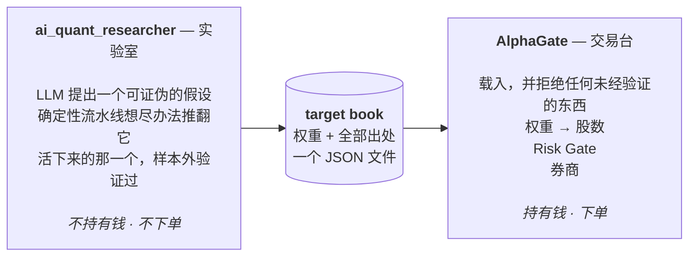
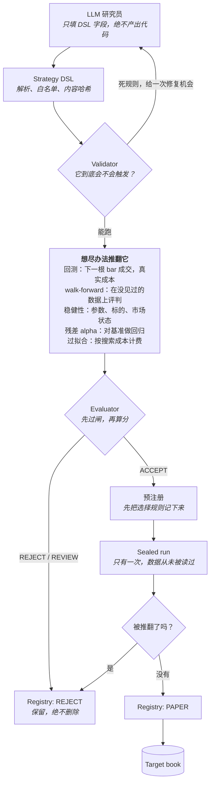
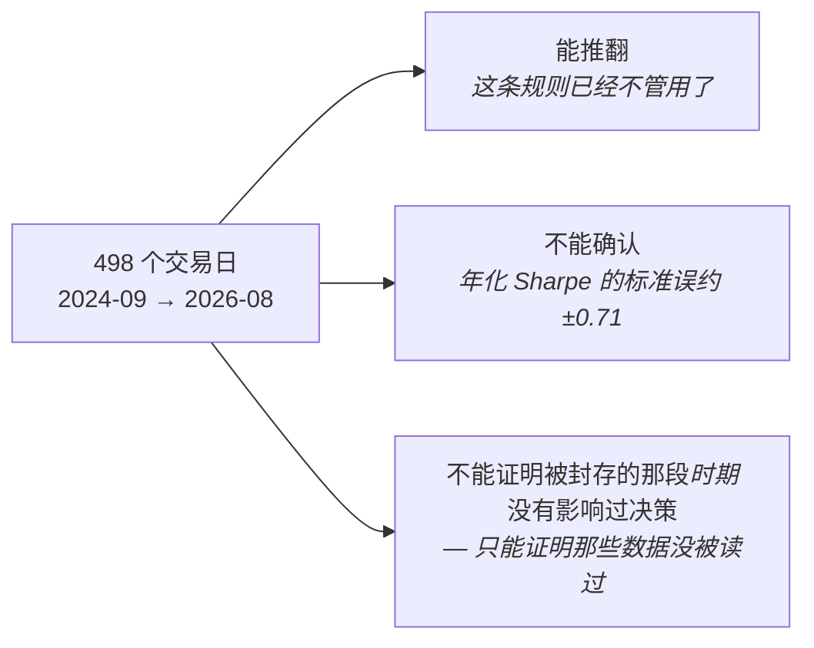
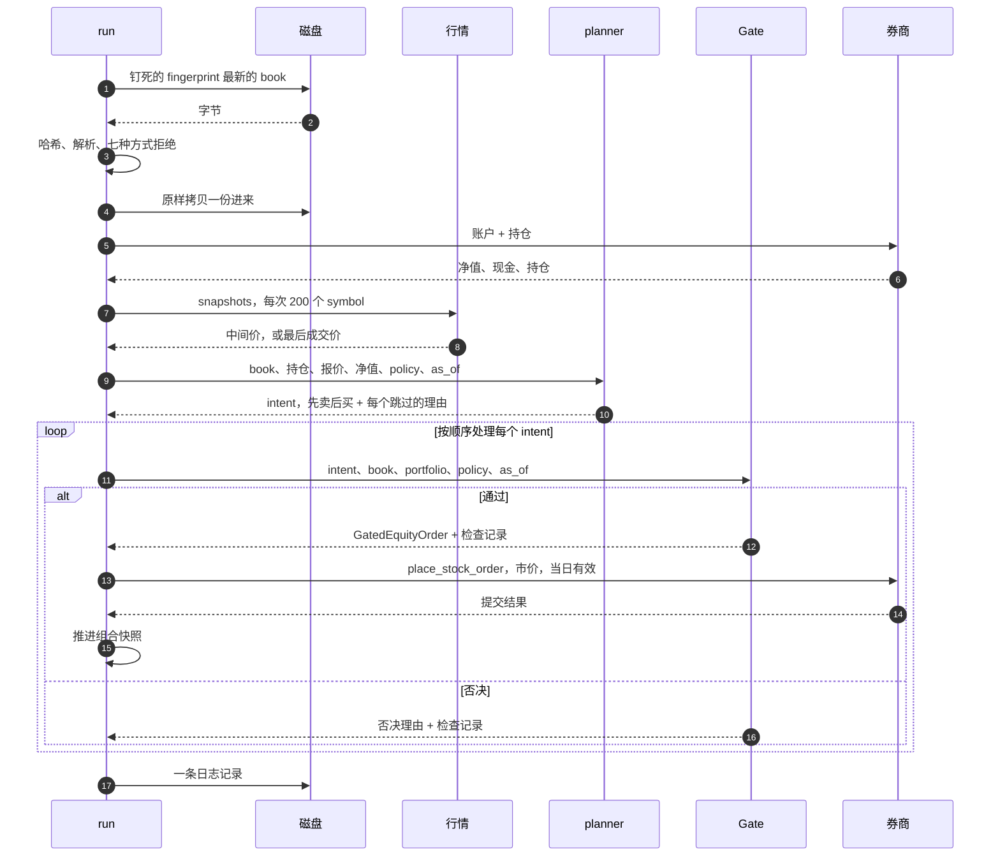
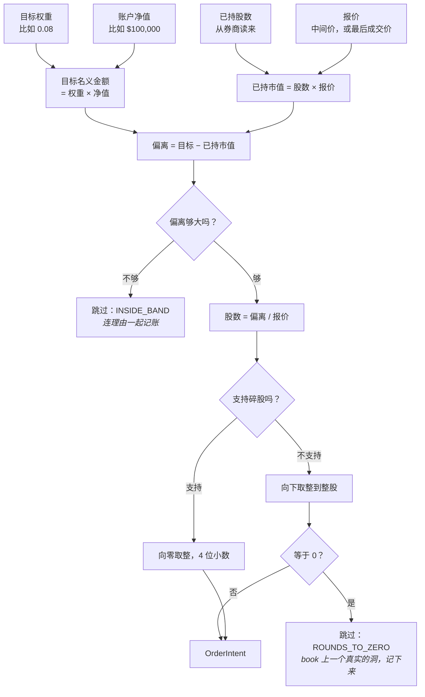
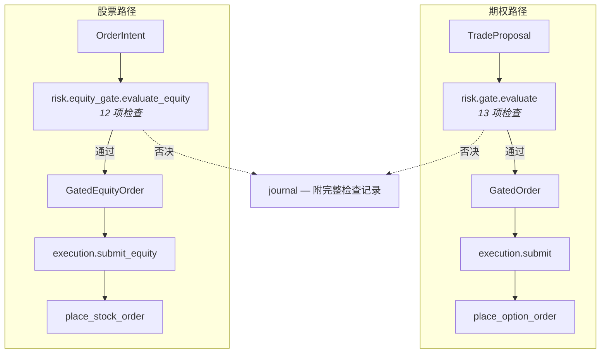
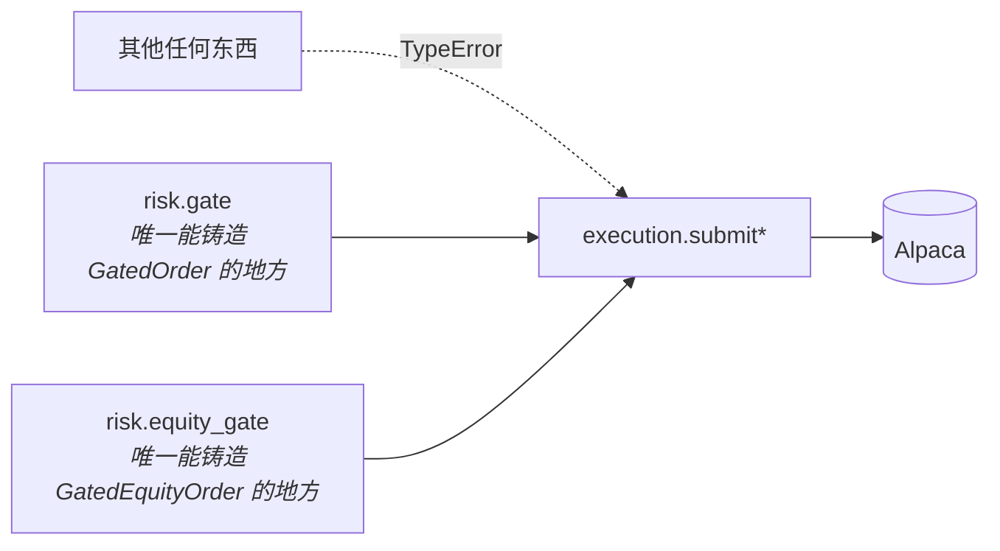
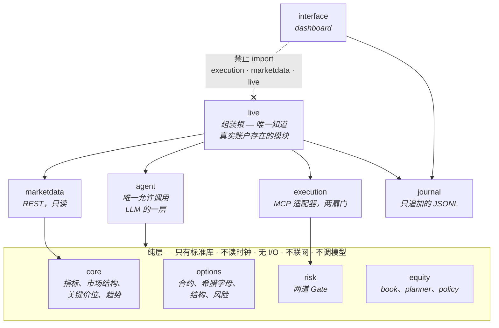
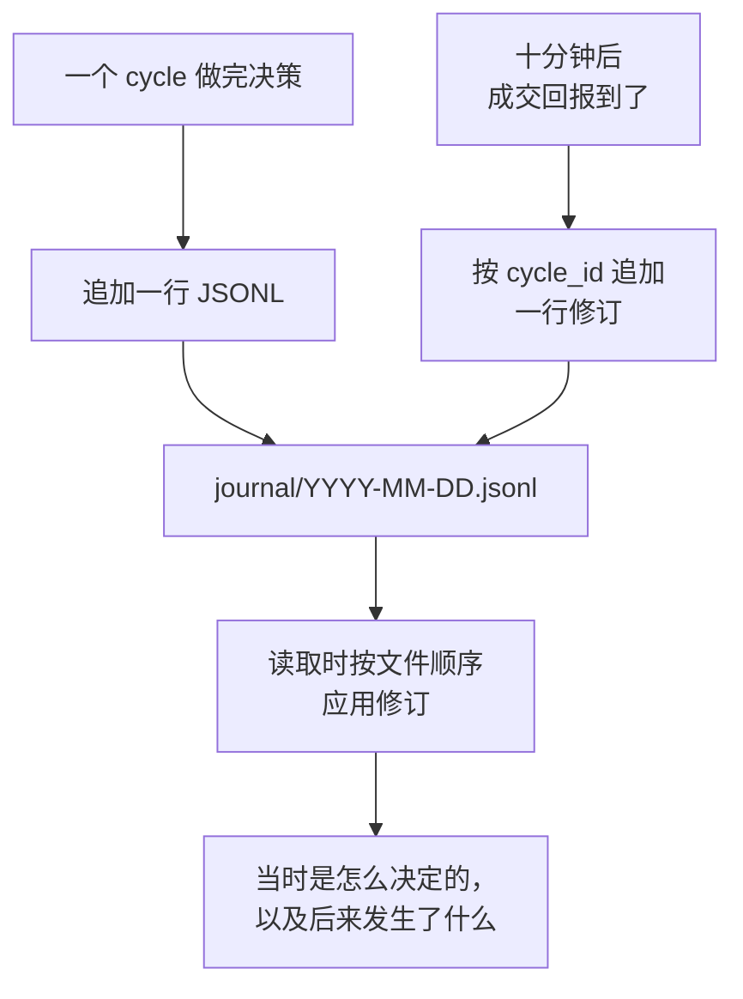
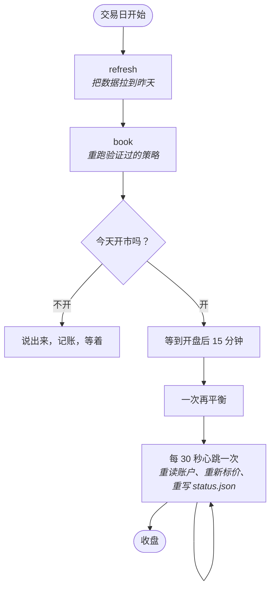

*语言：* [English](ARCHITECTURE.md) · **简体中文**

# 架构与运作流程

这份文档讲的是**系统由哪些部分组成、跑起来的时候发生了什么**。想知道"这是什么、
怎么启动"，看 [README](../README.zh-CN.md)；想知道每一层必须满足的契约，看
[`specs/`](../specs/)。

---

## 1. 整体形状

这个仓库里住着两套互相独立的系统。它们回答不同的问题、持有不同的不变量，
之间只有一个连接：一个文件。

实验室不持有钱、不下单；交易台两样都做。

**为什么要分开。** 实验室没有 `Decimal` 规则，因为它不碰钱；没有 Risk Gate，
因为它不下单。交易台两样都有。任何一个方向的 import 都会让一边的不变量变成
另一边的问题。`backend/tests/test_boundaries.py` 会在 `alphagate` import `aqr`、
`aqr` import `alphagate`、或者调用两边的驱动脚本 import 了任何一边时让构建失败。

**为什么用文件连接。** 文件可以被哈希、拷贝、提交、并在一年后被一个从没听说过
这两个项目的程序读走。target book 自带策略指纹、seal 状态、sealed 窗口的测量结果，
以及两个多重比较分母——读者不需要相信这份文档就能审计权重的来历。

---

## 2. 实验室：从一个猜想到一个验证过的策略

### 让它不只是一次回测的三件事

**LLM 产出的是假设，不是代码。** `close <= ema(20) * 1.01 and rsi(14) > 40`
这样的表达式会被词法分析成一棵 AST，叶子只能是数字和特征注册表里的名字。
不需要沙箱，因为根本没有危险的东西可以表达。

**下一根 bar 成交，没有开关。** 基于第 *t* 根 bar 做的决策，永远在第 *t+1* 根的
开盘价成交。没有任何配置能放松这一点——一个 look-ahead 开关就是一个附带了理由的
look-ahead bug。

**最近两年被封存。** 它们在物理上不存在于搜索用的缓存里；污染标记挂在 `Bars`
类型上而不是挂在每个 provider 上；一本只追加的账本记录读过什么。每个候选只能对
那个窗口跑**一次**，而且被筛选过的候选数量会被作为多重比较惩罚计入——
`t = +2.22` 作为第一次窥视能过线，作为第七次就过不了。

### sealed 窗口能说什么、不能说什么

`can_confirm` 这个属性在构造上就永远返回 `False`。dashboard 会把这句话印在数字
旁边——一个写着"已确认"的页面是在宣称一件没有人测量过的事。

---

## 3. 交易台：从一个文件到一笔股票单

### 3.1 一次再平衡，从头到尾

这个循环里有两个细节是承重的。

**每下一单就推进一次快照。** 如果每一单都拿这一轮开始时的账户状态去judge，
那一百单可以每一单都通过日周转检查、而这一百单加起来会超限——上限就变成了
"轮与轮之间才生效"，那不是它写的意思。

**传输失败会停掉整轮，而不是跳过这一单。** 已经下出去的单算数并被记账；
剩下的干脆不尝试，下一轮从券商实际持有的仓位重新推导——那是唯一不可能记错
发生过什么的来源。

### 3.2 一个权重怎么变成股数

**band 是仓位自身的比例，不是账户的比例。** 阈值是
`max(20% × max(目标, 已持), $25)`，对两者中较大的那个衡量——所以同一条规则
同时覆盖建仓、漂移、清仓三种情况。

第一版把它写成了净值的比例：0.25%，在 $100k 账户上是 $253。而这个 book 的
sleeve 仓位每个只有 $194，于是**一百个 sleeve 名字永远待在 band 里面，
一次都建不了仓**。能执行的 book 只剩下十个 core 名字加一堆现金：策略的十分之一，
而且不会报任何错。

**book 里不再要的 symbol，用同一套算术卖到零。** 它的目标权重不存在，
所以目标金额是零，所以偏离就是整个仓位。没有单独的退出规则，因此也没有
"忘了调用"这回事。

### 3.3 两道 Gate

它们**不是**同一道 Gate 换了参数。期权那道判断的是义务腿行权价、到期天数、
风险有限的价差宽度；这些对股票单一个都不存在。股票那道判断的是集中度、
总敞口、购买力、周转、单量、回撤；这些也都不是价差要关心的事。

它们真正共享的是纪律，而这部分完全一样：

| 规则 | 含义 |
| --- | --- |
| 纯 | 只依赖标准库。不读时钟、不做 I/O、不联网、不调模型。 |
| 全 | 每项检查都跑；不会因为第一个否决就短路。 |
| 确定 | 检查元组本身**就是** `checks` 和 `reasons` 的顺序。 |
| 边界含端点 | 恰好等于上限的值算通过。 |
| 唯一铸造点 | gated 类型只能在唯一一个模块里构造。 |
| 平仓豁免 | 降低风险的单子不会被预算类检查挡住。 |

### 3.4 唯一的门，两扇

`GatedOrder.__post_init__` 会向上走调用栈，除非调用帧属于
`alphagate.risk.gate`，否则拒绝构造。`GatedEquityOrder` 对
`alphagate.risk.equity_gate` 做同样的事。用栈帧检查是不常见的做法，而且是刻意选的：
模块私有 token 可以被 import，约定在第五天会被忘掉，code review 没法交给 CI 跑。

有两个后果值得提前知道，免得半夜被吓到：对一个 gated order 做 `copy.deepcopy`、
`pickle` 或 `dataclasses.replace` 都会抛异常。这是对的——一个能被克隆成第二个
订单的订单，就是一个能被提交两次的订单。

静态的那一半在 `test_boundaries.py` 里：它扫描 `execution/` 下所有以 `submit`
开头的函数，断言第一个参数是某个 gated 类型，并且每个 gated 类型恰好有一扇门。
这个守卫的第一版只认识 `submit` 这个完整单词，`submit_equity` 会径直溜过去。

---

## 4. 分层，以及靠什么强制

上面每一条线都由测试检查，而不是靠自觉：

| 守卫 | 拒绝什么 |
| --- | --- |
| 1 | 纯层 import 了标准库和兄弟模块以外的东西 |
| 2 | `agent/` 之外出现 LLM SDK |
| 3 | 纯层出现网络库 |
| 4 | 用 float 字面量构造 `Decimal` |
| 5 | gated 类型在唯一模块之外被铸造，或某扇门接受了未过闸的类型 |
| 6 | `marketdata` 里出现写动词——它只能发 GET |
| 7 | 模型自报的 confidence 流到了仓位计算或 Gate |
| 8 | `interface` import 了 `execution`、`marketdata` 或 `live` |
| 9 | 两个项目互相 import，或驱动脚本 import 了其中任何一个 |

守卫 8 是演示当天最要紧的那条：**从浏览器到下单没有任何代码路径。**
dashboard 通过 agent 写的一个 JSON 文件了解实时持仓——这也是它会诚实失败的原因：
agent 停了，文件就不再被重写，页面显示*未运行*，而不是拿一张过期的持仓表
摆出一副确信的样子。

---

## 5. 记录

**修订，而不是修改。** 一条记录只写一次。后来的事实作为独立的行到达，
读取时按文件顺序应用——所以原始决策保持它被做出时的样子，事后诸葛亮
不会倒流回去。

**里面没有任何凭据。** 每一行在写出去之前都过一遍 `redact`，按字段名、
按形状（`PK…`、`sk-…`、`PA3…`）、以及按所在对象三种方式剥离。最后那种是因为
Alpaca 把账户 id 作为一个裸 `id` 返回，而**订单**也有一个对账必须保留的裸 `id`——
没有正则能区分两个 UUID，只有包着它们的那个对象可以。

**安静的 cycle 也要记账**，而在股票策略上它们是多数：每五个交易日再平衡一次，
所以五天里有四天诚实的答案就是"book 已经拿在手上了"。一本只记成交的账本
说不出这句话。

落到磁盘上的东西：

| 路径 | 是什么 |
| --- | --- |
| `journal/YYYY-MM-DD.jsonl` | 每个 cycle 一行，两个 agent 共用，只追加 |
| `journal/books/` | 每一份真正被执行过的 target book，逐字节保存 |
| `journal/status.json` | 期权 agent 此刻的状态 |
| `journal/equity-status.json` | 股票 book 此刻的状态 |
| `journal/state.json`、`journal/equity-state.json` | 净值高水位与熔断闩锁，跨日保留 |

---

## 6. 每日循环

`python scripts/pipeline.py` 一次跑完三个阶段。这个驱动用子进程调两边的 CLI，
两边都不 import。

**开盘后十五分钟**，因为开盘集合竞价要先落定，快照中间价才是一个价格而不是
一个假象——而且中午下的 book 已经不是策略当初决定的那个 book 了。

**心跳是这个进程大部分时间在做的事**，它不是装饰。在一个每五天才再平衡一次的
策略上，一个只在要交易时才醒来的进程，和一个已经死掉的进程看起来一模一样。

**刻意缺席的那个阶段是 `research`。** 一次 campaign 会消耗对 sealed 窗口的窥视
次数——这个仓库里每一个结论都被这个多重比较分母打过折——而一个每晚偷偷又筛掉
七个候选的定时任务，会在没人注意的情况下让 dashboard 上印的那个 `t` 失效。
要不要跑一次，是人来决定的。

---

## 7. 仓库地图

| 路径 | 是什么 |
| --- | --- |
| `backend/src/alphagate/core/` | 确定性市场分析。从既有项目抽取，**不要重写**（[adr/0001](../adr/0001-core-reuse.md)） |
| `backend/src/alphagate/options/` | 合约、希腊字母、结构、风险。纯 |
| `backend/src/alphagate/equity/` | target book、planner、执行策略。纯 |
| `backend/src/alphagate/risk/` | 两道 Gate、两种裁决类型。纯 |
| `backend/src/alphagate/agent/` | 感知、菜单、prompt、proposer。**唯一的 LLM 层** |
| `backend/src/alphagate/execution/` | MCP 适配器、幂等键、两扇门 |
| `backend/src/alphagate/marketdata/` | REST 行情。只读 |
| `backend/src/alphagate/journal/` | 只追加的记录、脱敏、对账 |
| `backend/src/alphagate/live/` | 组装根与 CLI |
| `backend/src/alphagate/interface/` | dashboard。只 import journal，别的都不 import |
| `ai_quant_researcher/src/aqr/` | 实验室。不从 `alphagate` import 任何东西 |
| `frontend/` | dashboard 的 React 应用，构建进 Python 包 |
| `scripts/pipeline.py` | 三阶段驱动。两个项目都不 import |
| `specs/` | 契约，先于它们所管辖的代码写成 |
| `adr/` | 决策，以及背后的理由 |
| `journal/` | 提交作品所依据的记录 |

---

## 8. 接着读什么

| 问题 | 文件 |
| --- | --- |
| 我要怎么跑起来？ | [README](../README.zh-CN.md) |
| Risk Gate 必须拒绝什么？ | [specs/03](../specs/03-risk-gate.md) |
| 订单是怎么到 Alpaca 的？ | [specs/04](../specs/04-execution.md) |
| journal 里有什么，为什么？ | [specs/06](../specs/06-journal.md) |
| 一个验证过的策略怎么变成持仓？ | [specs/09](../specs/09-equity-execution.md) |
| 策略一开始是怎么被验证的？ | [ai_quant_researcher/README](../ai_quant_researcher/README.md) |
| 为什么 `core/` 是复用而不是重写？ | [adr/0001](../adr/0001-core-reuse.md) |
| 为什么下单走 MCP、行情走 REST？ | [adr/0002](../adr/0002-execution-via-mcp.md) |
